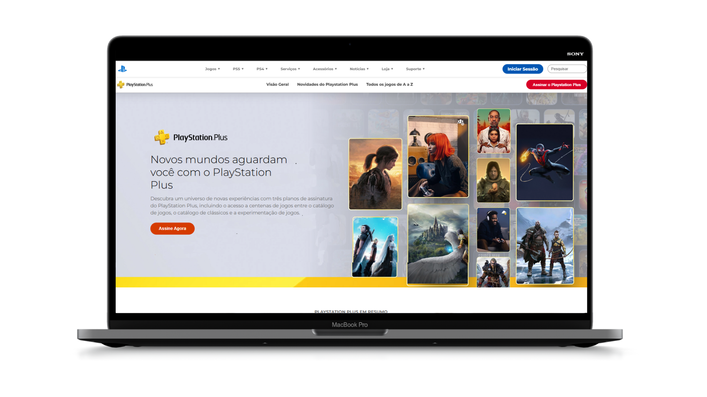
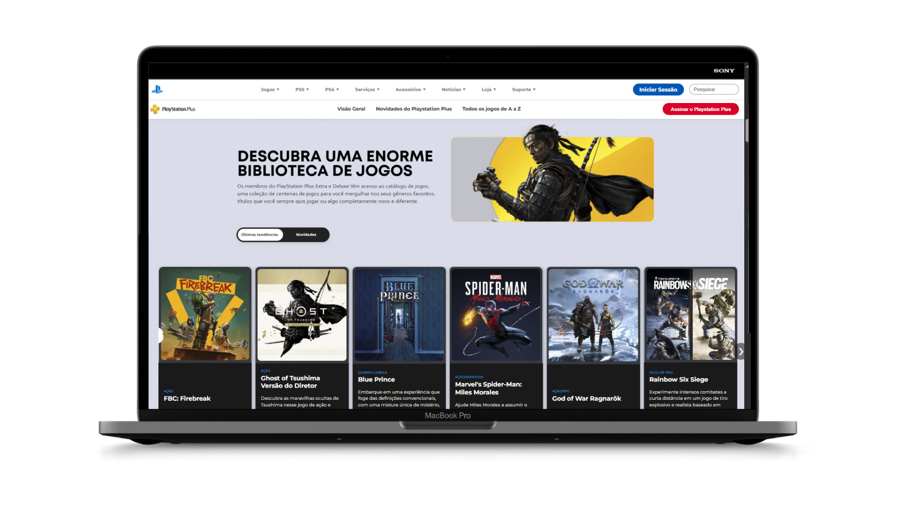
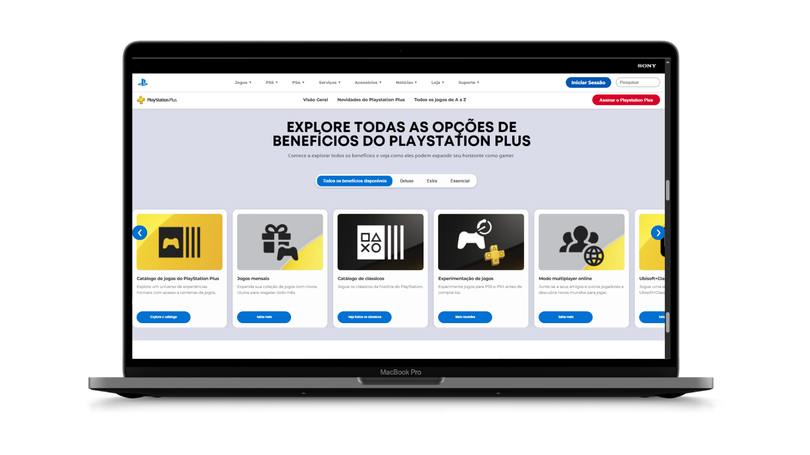
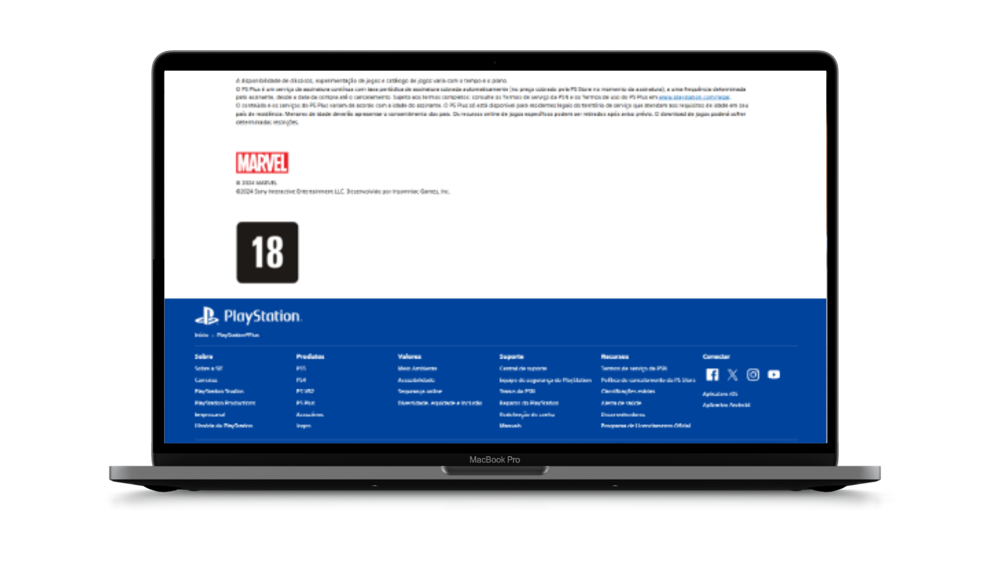

# Replica Site PlayStation Plus (Estritamente educacional)

## 📖 Descrição

Este projeto é uma recriação do site oficial da **PlayStation Plus** (playstationplus.com) desenvolvido com **HTML5**, **CSS3** e **JavaScript** exclusivamente para fins educacionais. Meu objetivo principal foi aplicar e aprimorar minhas habilidades em desenvolvimento web front-end, criando uma réplica visual e funcional do site original. O projeto abrange desde a estruturação semântica do conteúdo até a implementação de layouts responsivos e interatividades dinâmicas, refletindo as melhores práticas de codificação e design moderno. 

Como um programador iniciante, escolhi este site por sua interface moderna, rica em elementos visuais e interativos, como banners animados, cards de planos e menus responsivos, que me desafiaram a explorar conceitos avançados de **UI/UX**, responsividade e manipulação do DOM. Este projeto serve como uma peça do meu portfólio, demonstrando minha capacidade de traduzir designs complexos em código funcional e visualmente fiel, além de reforçar meu compromisso com o aprendizado contínuo em desenvolvimento web. 

**Nota:** Este projeto é estritamente educacional e não tem afiliação com a Sony ou o PlayStation Plus. Todos os ativos visuais foram recriados ou são placeholders, respeitando os direitos autorais.

---

## 🎯 Objetivos do Projeto

- Praticar e aprimorar habilidades em **HTML5** (estruturação semântica), **CSS3** (estilização e responsividade) e **JavaScript** (interatividade).
- Implementar um design moderno inspirado no site oficial do PlayStation Plus.
- Aplicar conceitos de **UI/UX**, como navegação intuitiva e layout responsivo.
- Demonstrar boas práticas de desenvolvimento, como organização de código, uso de variáveis CSS e modularização em JavaScript.

---

## 🛠️ Tecnologias Utilizadas

- **HTML5**: Estruturação semântica do conteúdo.
- **CSS3**: Estilização com Flexbox, Grid, animações e media queries para responsividade.
- **JavaScript**: Funcionalidades interativas, como menus dinâmicos, carrosséis e validação de formulários.
- **Ferramentas auxiliares**: 
  - VS Code (editor de código)
  - Figma (para referência de design, se aplicável)
  - Git/GitHub (controle de versão)

---

## 📸 Demonstração

Abaixo estão capturas de tela do projeto, mostrando o layout e as funcionalidades implementadas:

- ## **Homepage**: Página inicial com banner dinâmico e navegação.

- ## **Seção de Jogos**: Exibição de alguns jogos disponiveis com cards responsivos.  
  

  - ## **Seção Lista de Beneficios**: Exibição da lista de beneficios dos planos com cards responsivos.  
  

- ## **Footer**: Rodapé com links e design fiel ao original.  
  

---

## 🚀 Funcionalidades Implementadas

- **Layout Responsivo**: Adaptação para telas de desktop, tablet e dispositivos móveis.
- **Navegação Interativa**: Menu hamburger funcional e links de navegação.
- **Carrossel de Banners**: Animações suaves para exibir promoções (inspirado no site original).
- **Cards de Planos**: Exibição dos planos do PlayStation Plus com hover effects.
- **Formulários**: Validação básica de inputs (ex.: e-mail, senha) com JavaScript.
- **Animações CSS**: Transições suaves em botões, menus e outros elementos interativos.

---

## 📸 Demonstração

Abaixo estão capturas de tela do projeto, mostrando o layout e as funcionalidades implementadas de responsividade:
##

  

